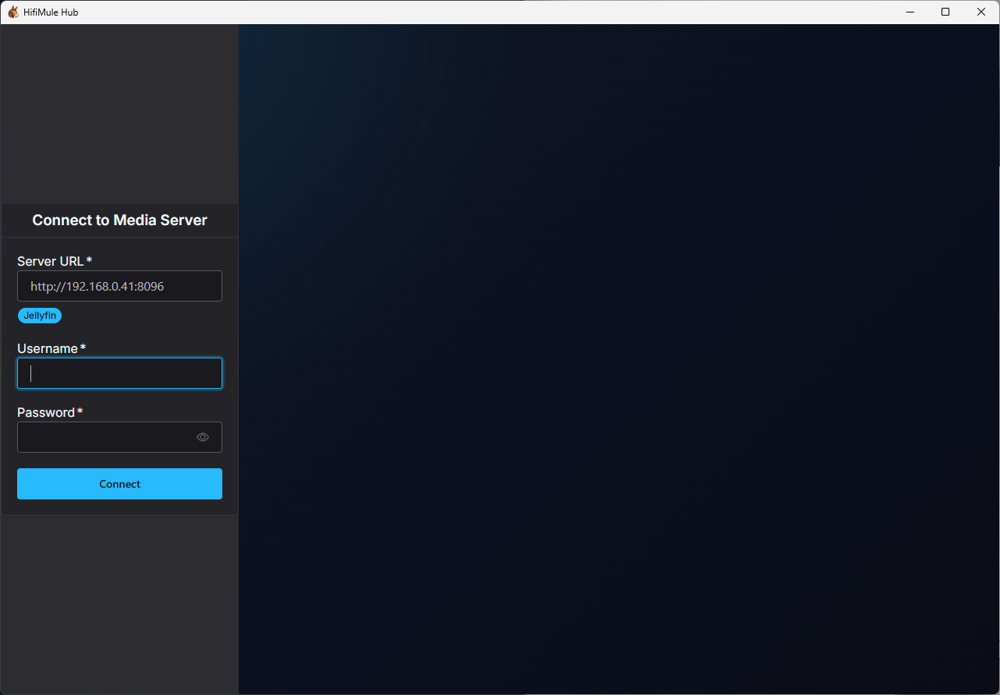
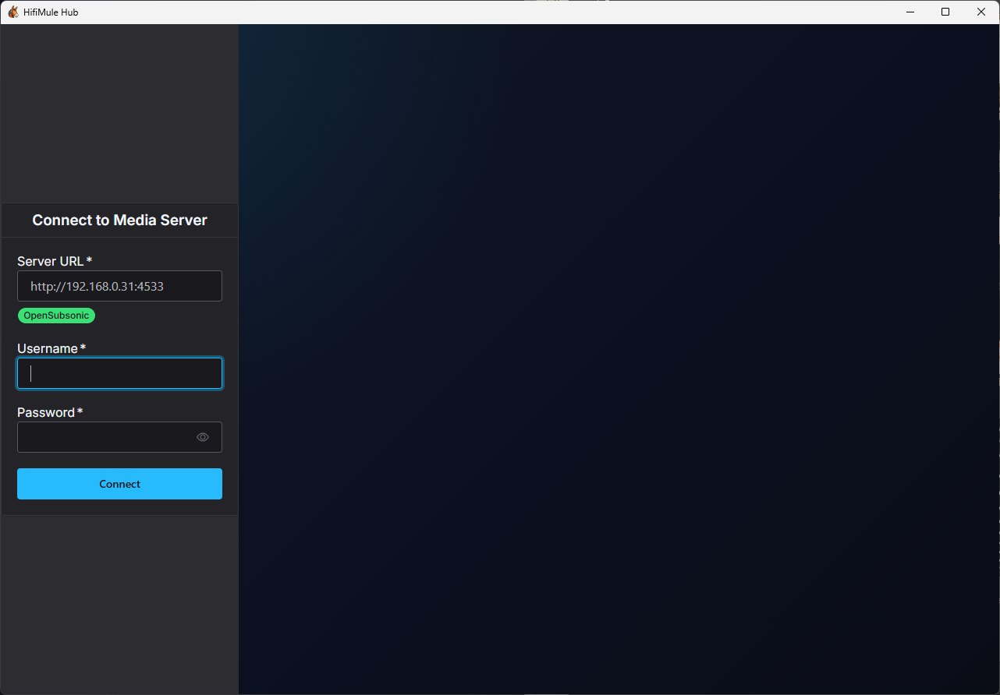
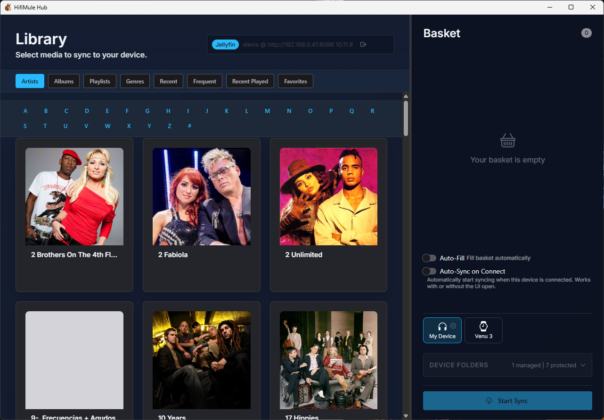
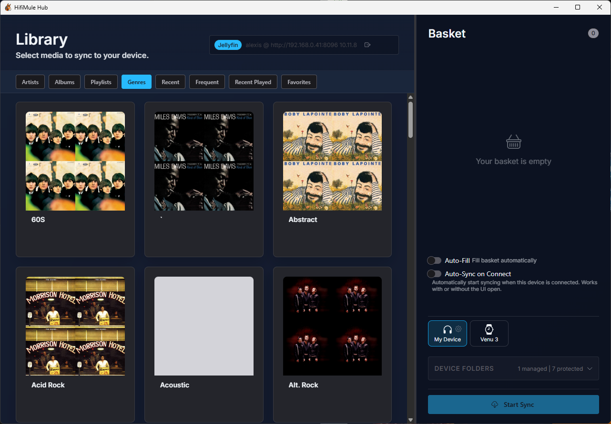
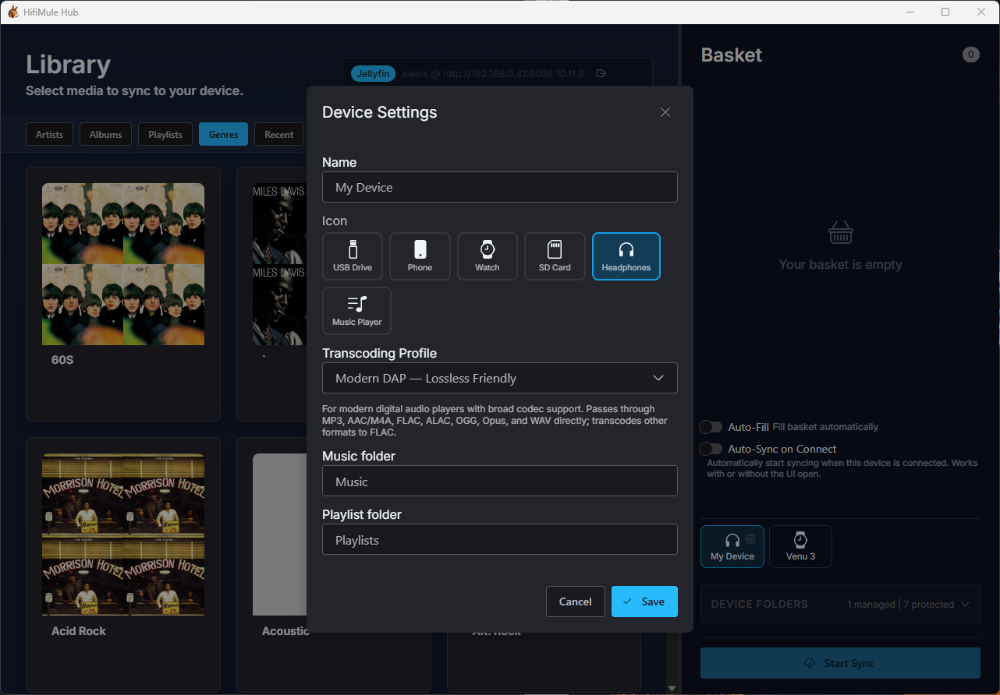
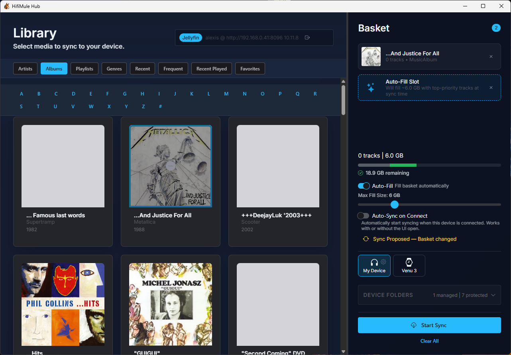
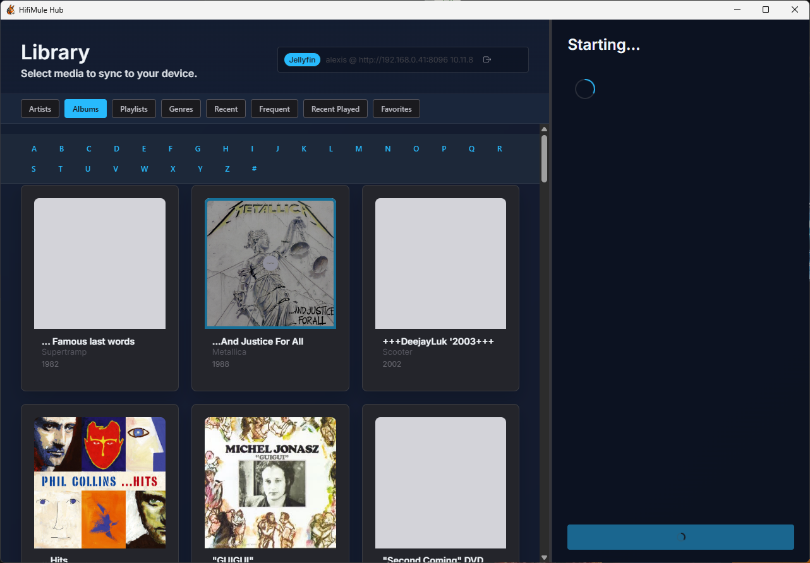

<p align="center">
  
</p>

<h1 align="center">HifiMule</h1>

<p align="center">
  Sync your open source media server library to portable devices — DAPs, iPods with Rockbox, USB players, and more.
</p>

---

HifiMule is a desktop application that bridges open source media servers and portable music players — from legacy mass-storage MP3 players to modern DAPs, MTP phones, and Garmin smartwatches. It supports [Jellyfin](https://jellyfin.org/) and Subsonic-compatible servers such as [Navidrome](https://www.navidrome.org/), and can manage several servers at once. Browse your library, pick what you want (or let auto-fill do it for you), and sync it to your device with delta transfers and resume support. Runs on Windows and macOS.

## Features

- **Multi-server hub** — Connect several media servers (any mix of Jellyfin, Subsonic, and Navidrome), name them, give them custom icons, and switch with a click. Your basket can hold music from multiple servers at once, syncing each item back to where it came from.
- **Rich library browsing** — Nine browse modes: Artists, Albums, Playlists, Tracks, Genres, Recently Added, Frequently Played, Recently Played, and Favorites. Switch between grid and list views with an A–Z jump strip for large collections.
- **Multi-select** — Tick checkboxes (or Ctrl/Cmd-click and Shift-click for ranges) to add many items to your basket or a playlist in one action.
- **Playlist editing** — Create, rename, delete, and reorder playlists; add or remove tracks; or turn your basket into a new playlist. Works on Jellyfin and Subsonic/Navidrome.
- **Auto-fill** — Automatically fill a device to a size or duration budget from your library, favorites, history, or playlists — with ordering rules, genre filters, quality/version preferences, and discovery mechanics (rarity, pity, context windows).
- **Selective & delta sync** — Add items to a sync basket and transfer only what you choose; HifiMule compares local and remote state and downloads only what's changed.
- **Quality-aware** — Tracks the bitrate of every file written and re-downloads when a higher-quality version appears; a Force Sync option wipes and re-downloads everything.
- **Resumable & cancellable transfers** — Interrupted syncs pick up where they left off, and a running sync can be cancelled cleanly. The sync preview explains *why* each file is added or removed.
- **Auto-sync** — Devices can sync automatically the moment they're connected.
- **Broad device support** — Built-in profiles for Rockbox players, Garmin smartwatches, modern DAPs, Sony Walkman, generic MP3 players, car USB sticks, and audiobook/podcast devices, plus MTP phones. Transcoding profiles convert audio to a device-compatible format only when needed.
- **Device management** — Initialize and edit devices, inspect storage, and configure name, icon, transcoding profile, music folder, and a separate playlist folder.
- **Manifest tracking** — A `.hifimule.json` manifest on-device tracks synced files with repair, prune, and relink tools.
- **Scrobble bridge** — Reads Rockbox playback logs and reports listening history back to your media server.
- **System tray daemon** — Runs in the background with status indicators (idle, scanning, syncing, error).
- **Hardware-aware** — Validates path lengths and filename character sets for legacy devices.
- **Multilanguage** — English, French, Spanish, and German.
- **Secure credentials** — Stores server credentials in a local, machine-bound encrypted vault, never in plain text.

## Screenshots

### Connect to your media server





### Browse, configure, and sync













## Disclaimer

This software was developed with the assistance of AI and the BMAD Method. As an experienced software developer, I have thoroughly validated the code to ensure its quality and reliability.


## Architecture

```
┌─────────────┐      JSON-RPC 2.0       ┌─────────────────┐      HTTP      ┌─────────────────────────┐
│  Tauri UI   │ ◄──────────────────────►│  Rust Daemon    │ ◄────────────► │ Jellyfin / Navidrome /  │
│  (Desktop)  │    127.0.0.1:19140      │  (System Tray)  │                │ Subsonic (one or more)  │
└─────────────┘                         └─────────────────┘                └─────────────────────────┘
```

Two-process design: the daemon handles all sync, provider, and device operations while the UI is a detachable Tauri window. A pluggable provider layer abstracts Jellyfin and Subsonic-compatible servers, and a server manager keeps multiple configured servers with a stable identity that travels with your devices. The daemon continues working even if the UI is closed, with an idle memory footprint under 10 MB.

## Tech Stack

| Layer | Technology |
|-------|-----------|
| Daemon | Rust, Tokio, Axum, Reqwest, SQLite (rusqlite), tray-icon |
| Devices | Mass-storage (USB), MTP via libmtp |
| UI | TypeScript, Tauri 2, Vite, Shoelace web components |
| i18n | Shared `hifimule-i18n` catalog crate (en, fr, es, de) |
| Communication | JSON-RPC 2.0 over HTTP |
| Credentials | Machine-bound encrypted vault (ChaCha20-Poly1305) |
| Build | Cargo workspaces, npm scripts, Tauri bundler |

## Prerequisites

- **Rust** 1.93.0+ ([rustup](https://rustup.rs/))
- **Node.js** LTS ([nodejs.org](https://nodejs.org/))
- **npm** (bundled with Node)
- Platform-specific Tauri dependencies — see the [Tauri prerequisites guide](https://v2.tauri.app/start/prerequisites/)

## Getting Started

```bash
# Clone
git clone <repository-url>
cd HifiMule

# Install dependencies
npm install
cd hifimule-ui && npm install && cd ..

# Development (two terminals)
# Terminal 1 — daemon
cargo run -p hifimule-daemon

# Terminal 2 — UI with hot-reload
cd hifimule-ui
npx tauri dev
```

### Build for release

```bash
npm run build            # Full build (UI + daemon)
npm run build:ui         # UI only (Tauri bundle)
npm run build:daemon     # Daemon release binary (builds full workspace)
```

### Run tests

```bash
cargo test               # All workspace tests
```

## Project Structure

```
HifiMule/
├── hifimule-daemon/       # Rust background service
│   ├── src/
│   │   ├── main.rs            # Bootstrap, tray icon, event loop
│   │   ├── rpc.rs             # JSON-RPC 2.0 router
│   │   ├── providers/         # Jellyfin & Subsonic media clients
│   │   ├── server_manager.rs  # Multi-server configuration & identity
│   │   ├── sync.rs            # Sync engine with delta + resume
│   │   ├── auto_fill/         # Auto-fill selection pipeline
│   │   ├── device/            # Device handling, incl. MTP (libmtp)
│   │   ├── device_io.rs       # Device file I/O
│   │   ├── transcoding.rs     # Audio transcoding
│   │   ├── scrobbler.rs       # Playback history tracking
│   │   ├── paths.rs           # Path validation for legacy devices
│   │   ├── vault.rs           # Encrypted credential vault
│   │   ├── db.rs              # SQLite persistence
│   │   ├── domain/            # Shared data models
│   │   └── tests.rs           # Integration tests
│   └── assets/                # Tray icons (idle, syncing, error)
│
├── hifimule-ui/           # Tauri 2 desktop app
│   ├── src/
│   │   ├── main.ts            # App init, routing, toasts
│   │   ├── login.ts           # Authentication page
│   │   ├── library.ts         # Library browser
│   │   ├── rpc.ts             # JSON-RPC client
│   │   ├── components/        # ServerHub, BasketSidebar, AutoFillPanel,
│   │   │                      #   PlaylistCurationView, TracksBrowseView,
│   │   │                      #   MediaCard, InitDeviceModal, RepairModal, StatusBar
│   │   └── state/             # State management
│   └── src-tauri/             # Tauri config & Rust glue
│
├── hifimule-i18n/         # Shared translation catalog (en, fr, es, de)
│
└── docs/                      # Generated documentation
```

## How It Works

1. **Connect** — Add one or more media servers (Jellyfin, Navidrome, or any Subsonic-compatible server) in the Server Hub and log in
2. **Browse** — Navigate your library across nine browse modes, switching servers as you go
3. **Select** — Add items to the sync basket — one at a time, in bulk, or automatically with auto-fill
4. **Plug in** — Connect your portable device, initialize it, and configure its folders and transcoding profile
5. **Sync** — HifiMule calculates deltas and transfers only what's needed; syncs can resume or be cancelled
6. **Listen** — Play music on your device; scrobble logs sync back to your media server

## Contributing

Contributions are welcome! Please open an issue to discuss changes before submitting a PR.
As I'm mostly using Windows as the development platform for HifiMule, I'm looking for feedback from Linux or Mac users.
I'm also looking for feedback from owners of various devices, as my collection is quite limited.

## Acknowledgements

- [Jellyfin](https://jellyfin.org/) — Free software media server
- [Navidrome](https://www.navidrome.org/) — Open source music server, Subsonic-compatible
- [Tauri](https://tauri.app/) — Build desktop apps with web tech and Rust
- [Shoelace](https://shoelace.style/) — Web component library
- [BMAD Method](https://github.com/bmad-code-org/BMAD-METHOD) - Breakthrough Method for Agile Ai Driven Development
