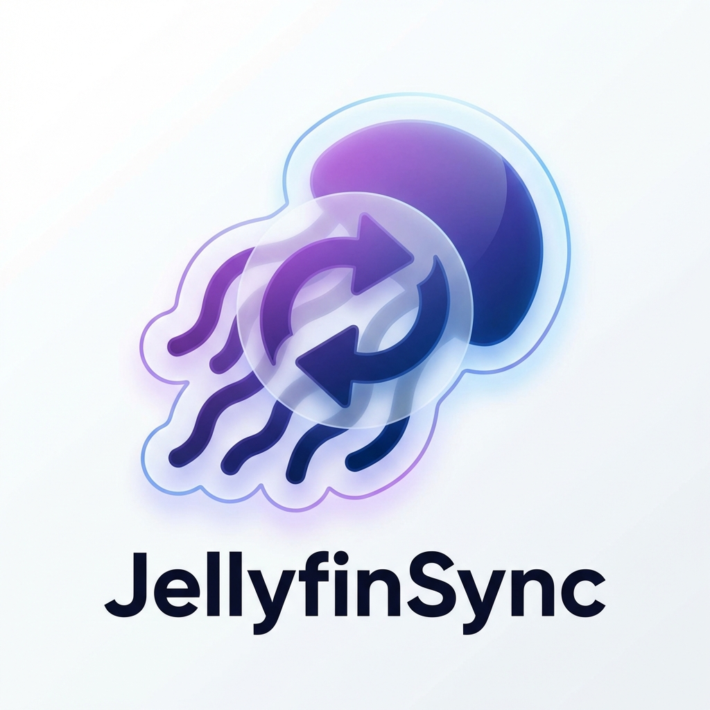

<p align="center">
  
</p>

<h1 align="center">JellyfinSync</h1>

<p align="center">
  Sync your Jellyfin media library to portable devices — DAPs, iPods with Rockbox, USB players, and more.
</p>

---

JellyfinSync is a desktop application that bridges your [Jellyfin](https://jellyfin.org/) media server and legacy mass-storage MP3 players. Browse your library, pick what you want, and sync it to your device with delta transfers and resume support.

## Disclaimer

This software was developed with the assistance of AI and the BMAD Method. As an experienced software developer, I have thoroughly validated the code to ensure its quality and reliability.

## Features

- **Library browsing** — Navigate views, collections, and albums directly from your Jellyfin server
- **Selective sync** — Add items to a sync basket and transfer only what you choose
- **Delta sync** — Compares local and remote state; downloads only what's changed
- **Resumable transfers** — Interrupted syncs pick up where they left off
- **Device management** — Initialize devices, inspect storage, configure sync profiles
- **Manifest tracking** — A `.jellyfinsync.json` manifest on-device tracks synced files with repair and prune tools
- **Scrobble bridge** — Reads Rockbox `.scrobbler.log` files and reports playback history back to Jellyfin
- **System tray daemon** — Runs in the background with status indicators (idle, syncing, error)
- **Hardware-aware** — Validates path lengths and filename character sets for legacy devices
- **Secure credentials** — Stores Jellyfin tokens in the OS keyring, never on disk

## Architecture

```
┌─────────────┐      JSON-RPC 2.0       ┌─────────────────┐      HTTP      ┌─────────────────┐
│  Tauri UI   │ ◄──────────────────────►│  Rust Daemon    │ ◄────────────► │ Jellyfin Server │
│  (Desktop)  │    127.0.0.1:19140      │  (System Tray)  │                │                 │
└─────────────┘                         └─────────────────┘                └─────────────────┘
```

Two-process design: the daemon handles all sync, API, and device operations while the UI is a detachable Tauri window. The daemon continues working even if the UI is closed, with an idle memory footprint under 10 MB.

## Tech Stack

| Layer | Technology |
|-------|-----------|
| Daemon | Rust, Tokio, Axum, Reqwest, SQLite (rusqlite), tray-icon |
| UI | TypeScript, Tauri 2, Vite, Shoelace web components |
| Communication | JSON-RPC 2.0 over HTTP |
| Credentials | OS keyring via `keyring` crate |
| Build | Cargo workspaces, npm scripts, Tauri bundler |

## Prerequisites

- **Rust** 1.93.0+ ([rustup](https://rustup.rs/))
- **Node.js** LTS ([nodejs.org](https://nodejs.org/))
- **npm** (bundled with Node)
- Platform-specific Tauri dependencies — see the [Tauri prerequisites guide](https://v2.tauri.app/start/prerequisites/)

## Getting Started

```bash
# Clone
git clone <repository-url>
cd JellyfinSync

# Install dependencies
npm install
cd jellyfinsync-ui && npm install && cd ..

# Development (two terminals)
# Terminal 1 — daemon
cargo run -p jellyfinsync-daemon

# Terminal 2 — UI with hot-reload
cd jellyfinsync-ui
npx tauri dev
```

### Build for release

```bash
npm run build            # Full build (UI + daemon)
npm run build:ui         # UI only (Tauri bundle)
npm run build:daemon     # Daemon release binary (builds full workspace)
```

### Run tests

```bash
cargo test               # All workspace tests
```

## Project Structure

```
JellyfinSync/
├── jellyfinsync-daemon/       # Rust background service
│   ├── src/
│   │   ├── main.rs            # Bootstrap, tray icon, event loop
│   │   ├── rpc.rs             # JSON-RPC 2.0 router
│   │   ├── api.rs             # Jellyfin HTTP client
│   │   ├── sync.rs            # Sync engine with delta + resume
│   │   ├── scrobbler.rs       # Playback history tracking
│   │   ├── paths.rs           # Path validation for legacy devices
│   │   ├── db.rs              # SQLite persistence
│   │   └── tests.rs           # Integration tests
│   └── assets/                # Tray icons (idle, syncing, error)
│
├── jellyfinsync-ui/           # Tauri 2 desktop app
│   ├── src/
│   │   ├── main.ts            # App init, routing, toasts
│   │   ├── login.ts           # Authentication page
│   │   ├── library.ts         # Library browser
│   │   ├── rpc.ts             # JSON-RPC client
│   │   ├── components/        # MediaCard, BasketSidebar, InitDeviceModal, RepairModal
│   │   └── state/             # State management
│   └── src-tauri/             # Tauri config & Rust glue
│
└── docs/                      # Generated documentation
```

## How It Works

1. **Connect** — Point JellyfinSync at your Jellyfin server and log in
2. **Browse** — Navigate your library views, collections, and albums
3. **Select** — Add items to the sync basket
4. **Plug in** — Connect your portable device and select the target folder
5. **Sync** — JellyfinSync calculates deltas and transfers only what's needed
6. **Listen** — Play music on your device; scrobble logs sync back to Jellyfin

## Contributing

Contributions are welcome! Please open an issue to discuss changes before submitting a PR.

## Acknowledgements

- [Jellyfin](https://jellyfin.org/) — The free software media system
- [Tauri](https://tauri.app/) — Build desktop apps with web tech and Rust
- [Shoelace](https://shoelace.style/) — Web component library
- [BMAD Method](https://github.com/bmad-code-org/BMAD-METHOD) - Breakthrough Method for Agile Ai Driven Development
