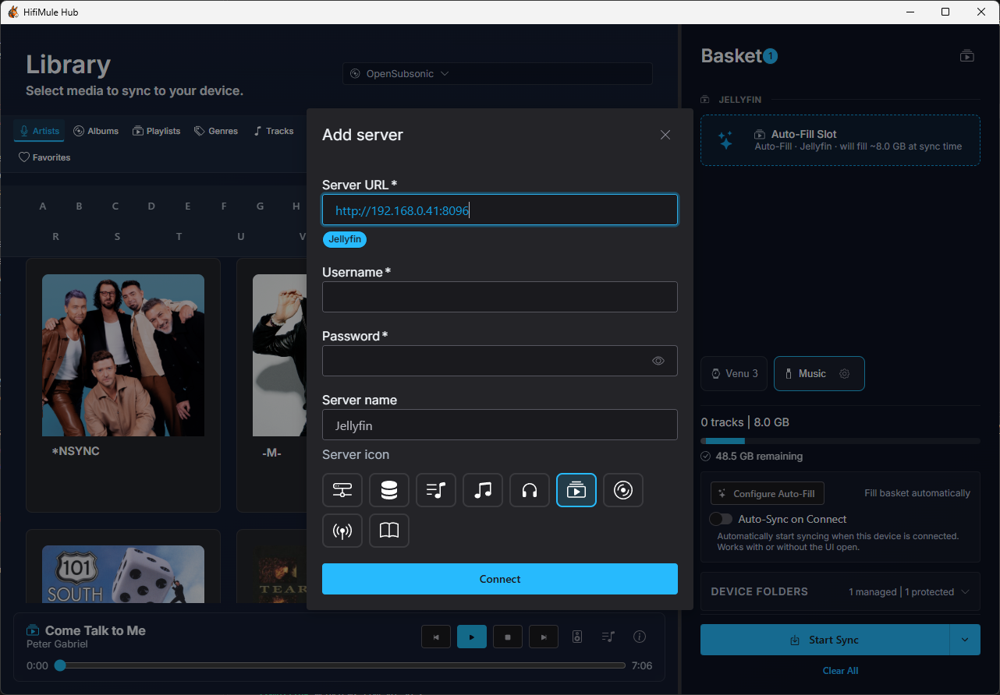
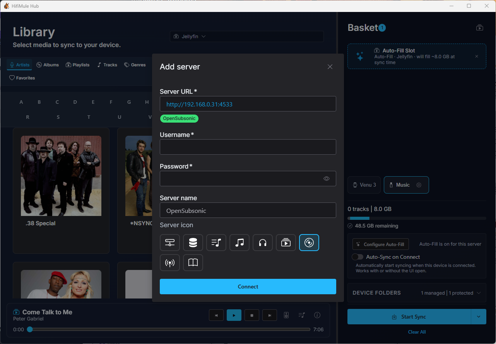
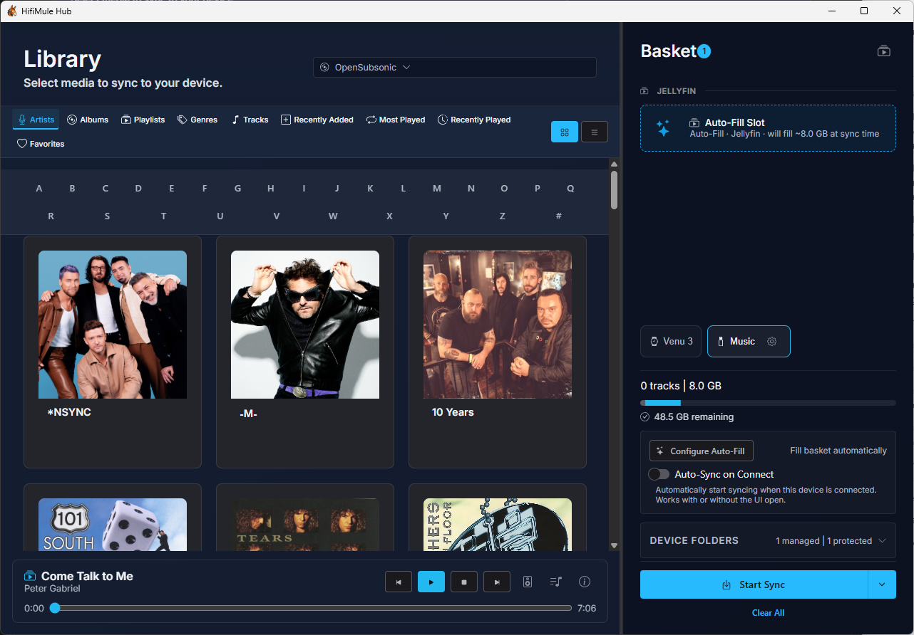
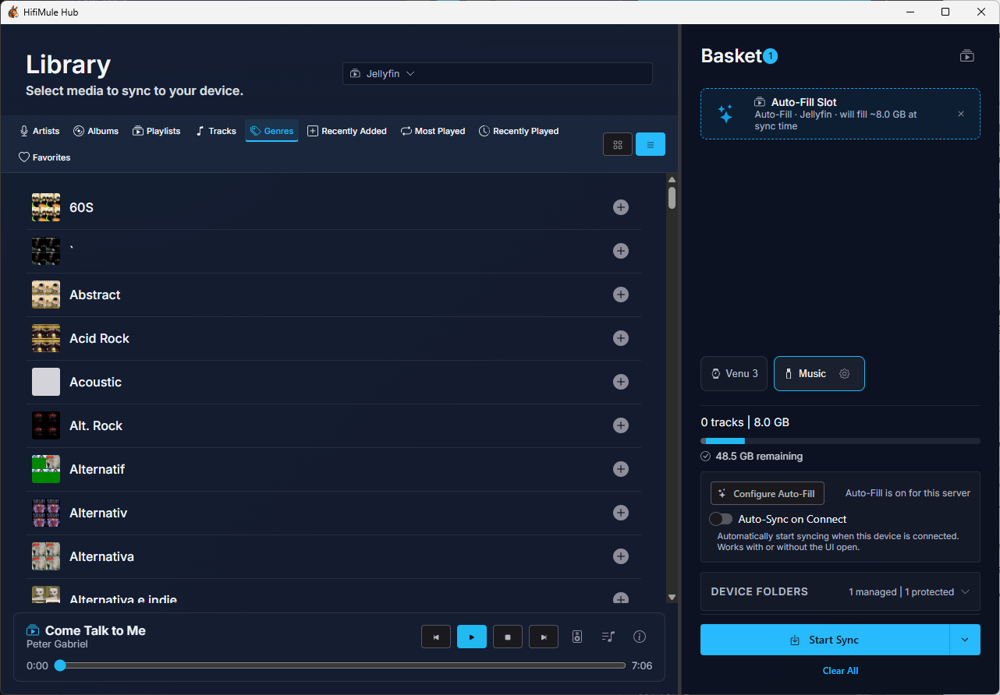
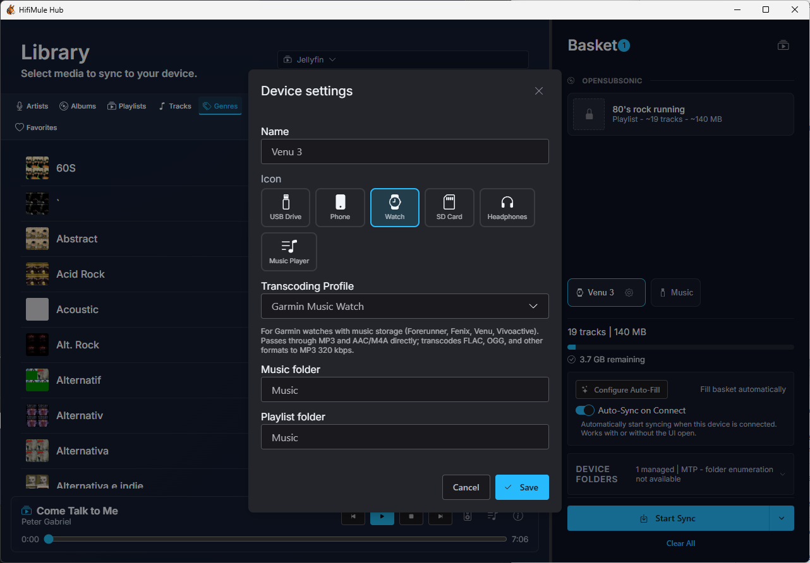
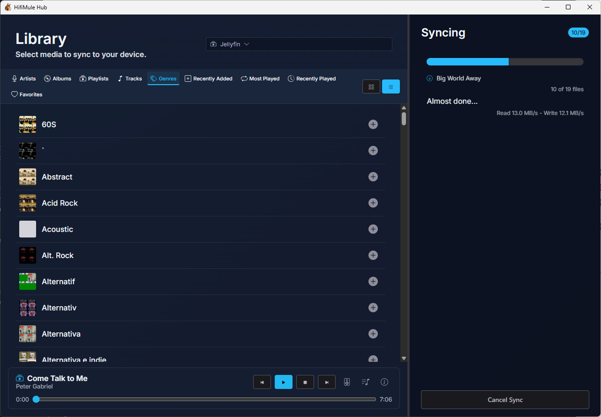
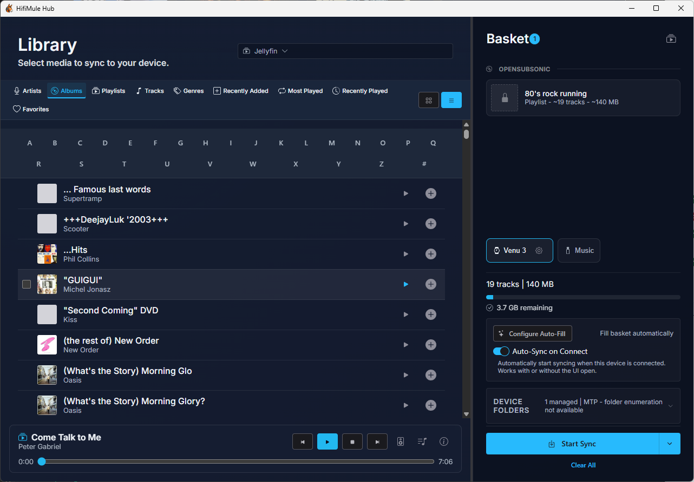
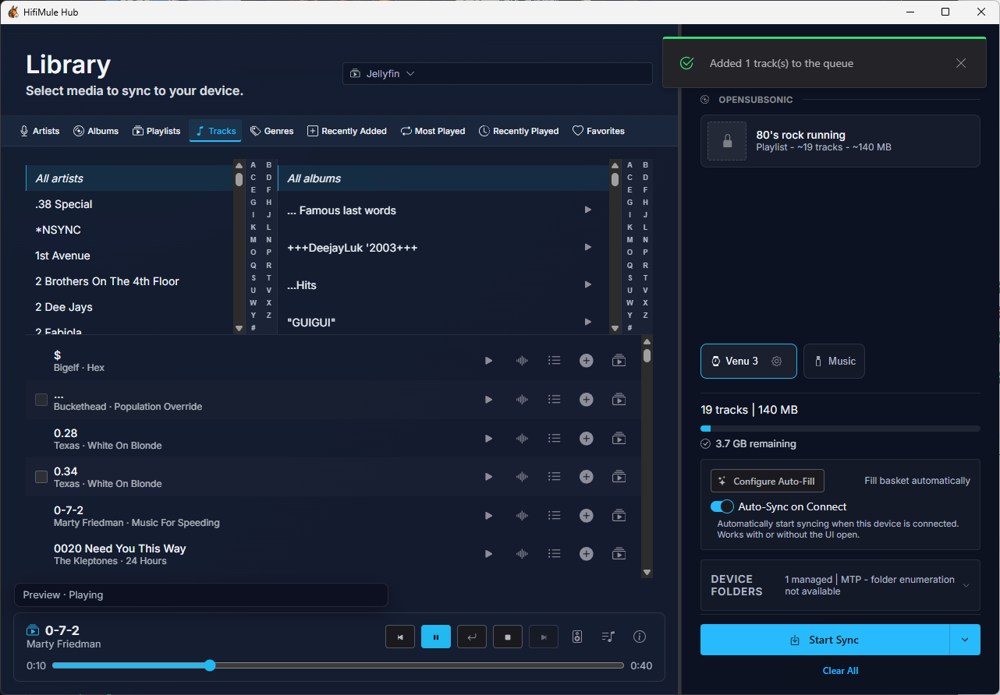
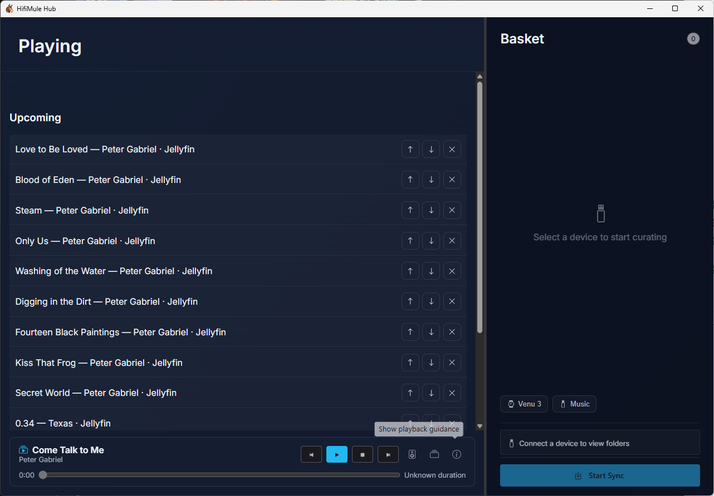

<p align="center">
  
</p>

<h1 align="center">HifiMule</h1>

<p align="center">
  Play music, audiobooks, and podcasts from your media servers and sync them to portable devices — DAPs, iPods with Rockbox, USB players, and more.
</p>

---

HifiMule is a desktop application that bridges self-hosted media servers and portable players — from legacy mass-storage MP3 players to modern DAPs, MTP phones, and Garmin smartwatches. It supports [Jellyfin](https://jellyfin.org/), Subsonic-compatible servers such as [Navidrome](https://www.navidrome.org/), and [Audiobookshelf](https://audiobookshelf.org/) Books and Podcasts libraries. Browse, listen directly on your computer, manage a playback queue, then sync selected media to a device with delta transfers and resume support. Runs on Windows, macOS, and Linux.

## Features

- **Multi-server hub** — Connect Jellyfin, Subsonic/Navidrome, and individual Audiobookshelf Books or Podcasts libraries; name them, give them icons, and switch with a click. Basket items retain their source server.
- **Rich library browsing** — Provider-specific modes include music Artists, Albums, Playlists, Tracks, Genres, history and Favorites; Audiobookshelf Books and Authors, Series and Collections; and Podcast Shows and Recent Episodes.
- **Built-in audio playback** — Play albums directly from your media server on your computer, with pause/resume, previous/next, seeking, and audio output selection.
- **Audiobooks and podcasts** — Play ordered book parts, podcast episodes, and playlists; sync Books and Podcasts with separate device folders and role-aware auto-fill policies.
- **Track previews** — Preview a track while browsing, then return to your listening session.
- **Playback queue** — Add tracks to the queue, view listening history and upcoming tracks, and reorder or remove upcoming tracks.
- **Multi-select** — Tick checkboxes (or Ctrl/Cmd-click and Shift-click for ranges) to add many items to your basket or a playlist in one action.
- **Playlist editing** — Create, rename, delete, and reorder playlists; add or remove tracks; or turn your basket into a new playlist. Works on Jellyfin and Subsonic/Navidrome.
- **Auto-fill** — Automatically fill a device to a size or duration budget from your library, favorites, history, or playlists — with ordering rules, genre filters, quality/version preferences, and discovery mechanics (rarity, pity, context windows).
- **Selective & delta sync** — Add items to a sync basket and transfer only what you choose; HifiMule compares local and remote state and downloads only what's changed.
- **Quality-aware** — Tracks the bitrate of every file written and re-downloads when a higher-quality version appears; a Force Sync option wipes and re-downloads everything.
- **Resumable & cancellable transfers** — Interrupted syncs pick up where they left off, and a running sync can be cancelled cleanly. The sync preview explains *why* each file is added or removed.
- **Auto-sync** — Devices can sync automatically the moment they're connected.
- **Broad device support** — Built-in profiles for Rockbox players, Garmin smartwatches, modern DAPs, Sony Walkman, generic MP3 players, car USB sticks, and audiobook/podcast devices, plus MTP phones. Transcoding profiles convert audio to a device-compatible format only when needed.
- **Device management** — Initialize and edit devices, inspect storage, and configure name, icon, transcoding profile, music folder, and a separate playlist folder.
- **Manifest tracking** — A `.hifimule.json` manifest on-device tracks synced files with repair, prune, and relink tools.
- **Scrobble bridge** — Reads Rockbox playback logs and reports listening history back to your media server.
- **System tray daemon** — Runs in the background with status indicators (idle, scanning, syncing, error).
- **Hardware-aware** — Validates path lengths and filename character sets for legacy devices.
- **Multilanguage** — English, French, Spanish, and German.
- **Secure credentials** — Stores server credentials in a local, machine-bound encrypted vault, never in plain text.

## Screenshots

### Connect to your media server





### Browse, configure, and sync










### Play albums, preview tracks, and manage upcoming tracks







## Disclaimer

This software was developed with the assistance of AI and the BMAD Method. As an experienced software developer, I have thoroughly validated the code to ensure its quality and reliability.


## Architecture

```text
Tauri UI (WebView + native shell)
    │ JSON-RPC 2.0 via authenticated loopback
    ▼
Rust daemon (playback, sync, providers, system tray)
    ├── HTTP/HTTPS → Jellyfin, Subsonic/OpenSubsonic, Audiobookshelf
    └── MSC/MTP    → portable devices
```

Two-process design: the daemon handles audio playback alongside sync, provider, and device operations while the UI is a detachable Tauri window. A pluggable provider layer abstracts Jellyfin, Subsonic-compatible servers, and Audiobookshelf. The shared lifecycle library coordinates one daemon and one UI per profile and publishes the daemon's available loopback port in a private owner descriptor. Portable server identities travel with your devices.

For code and feature maps, start with the [project documentation index](docs/index.md). The [Audiobookshelf implementation map](docs/audiobookshelf-implementation.md) covers Books and Podcasts behavior and boundaries.

## Tech Stack

| Layer | Technology |
|-------|-----------|
| Daemon | Rust, Tokio, Axum, Reqwest, SQLite (rusqlite), tray-icon |
| Audio playback | FFmpeg decoding, CPAL audio output, Souvlaki media controls |
| Devices | Mass-storage (USB), MTP via libmtp |
| UI | TypeScript, Tauri 2, Vite, Shoelace web components |
| i18n | Shared `hifimule-i18n` catalog crate (en, fr, es, de) |
| Lifecycle | Shared `hifimule-lifecycle` crate for daemon/UI ownership and authenticated local discovery |
| Communication | JSON-RPC 2.0 over HTTP |
| Credentials | Machine-bound encrypted vault (ChaCha20-Poly1305) |
| Build | Cargo workspaces, npm scripts, Tauri bundler |

## Prerequisites

- **Rust** 1.93.0+ ([rustup](https://rustup.rs/))
- **Node.js** LTS ([nodejs.org](https://nodejs.org/))
- **npm** (bundled with Node)
- Platform-specific Tauri dependencies — see the [Tauri prerequisites guide](https://v2.tauri.app/start/prerequisites/)

## Getting Started

```bash
# Clone
git clone <repository-url>
cd HifiMule

# Install dependencies
npm install
cd hifimule-ui && npm install && cd ..

# Development (two terminals)
# Terminal 1 — daemon
npm run build:daemon -- run -p hifimule-daemon

# Terminal 2 — UI with hot-reload
cd hifimule-ui
npx tauri dev
```

### Build for release

```bash
npm run build            # Full build (UI + daemon)
npm run build:ui         # UI only (Tauri bundle)
npm run build:daemon     # Daemon release binary with the controlled audio runtime
```

### Run tests

```bash
npm run build:daemon -- test --workspace   # All workspace tests
```

Use `npm run build:daemon -- <cargo arguments>` for daemon-related Cargo
commands. The wrapper provisions the pinned FFmpeg runtime and exports the
native build environment before Cargo starts. A raw `cargo build` cannot do
that early enough for dependency build scripts on Linux or Windows.

## Project Structure

```
HifiMule/
├── hifimule-daemon/       # Rust background service
│   ├── src/
│   │   ├── main.rs            # Bootstrap, tray icon, event loop
│   │   ├── rpc.rs             # JSON-RPC 2.0 router
│   │   ├── providers/         # Jellyfin & Subsonic media clients
│   │   ├── server_manager.rs  # Multi-server configuration & identity
│   │   ├── playback/          # Audio decoding, output, sessions, and queue
│   │   ├── sync.rs            # Sync engine with delta + resume
│   │   ├── auto_fill/         # Auto-fill selection pipeline
│   │   ├── device/            # Device handling, incl. MTP (libmtp)
│   │   ├── device_io.rs       # Device file I/O
│   │   ├── transcoding.rs     # Audio transcoding
│   │   ├── scrobbler.rs       # Playback history tracking
│   │   ├── paths.rs           # Path validation for legacy devices
│   │   ├── vault.rs           # Encrypted credential vault
│   │   ├── db.rs              # SQLite persistence
│   │   ├── domain/            # Shared data models
│   │   └── tests.rs           # Integration tests
│   └── assets/                # Tray icons (idle, syncing, error)
│
├── hifimule-ui/           # Tauri 2 desktop app
│   ├── src/
│   │   ├── main.ts            # App init, routing, toasts
│   │   ├── login.ts           # Authentication page
│   │   ├── library.ts         # Library browser
│   │   ├── rpc.ts             # JSON-RPC client
│   │   ├── components/        # ServerHub, BasketSidebar, AutoFillPanel,
│   │   │                      #   PlaybackControls, PlaybackDestination,
│   │   │                      #   PlaylistCurationView, TracksBrowseView,
│   │   │                      #   MediaCard, InitDeviceModal, RepairModal, StatusBar
│   │   └── state/             # State management
│   └── src-tauri/             # Tauri config & Rust glue
│
├── hifimule-i18n/         # Shared translation catalog (en, fr, es, de)
│
└── docs/                      # Generated documentation
```

## How It Works

1. **Connect** — Add one or more media servers (Jellyfin, Navidrome, or any Subsonic-compatible server) in the Server Hub and log in
2. **Browse** — Navigate your library across nine browse modes, switching servers as you go
3. **Play** — Start an album or preview a track directly in HifiMule; use the playback controls and queue to manage your listening session
4. **Select** — Add items to the sync basket — one at a time, in bulk, or automatically with auto-fill
5. **Plug in** — Connect your portable device, initialize it, and configure its folders and transcoding profile
6. **Sync** — HifiMule calculates deltas and transfers only what's needed; syncs can resume or be cancelled
7. **Listen on the go** — Play music on your device; scrobble logs sync back to your media server

### Listening in HifiMule

- Use an album’s play button to start listening on your computer. Control playback with pause/resume, previous/next, stop, and the seek bar.
- Use a track’s preview button to try it while browsing. **Return to session** takes you back to your main listening session.
- Use **Add to queue** on tracks to build your listening queue. Open the playback view to see listening history and **Upcoming** tracks, then move upcoming tracks up or down or remove them.
- Choose an **Audio output** from the playback controls to listen through your preferred device.

## Contributing

Contributions are welcome! Please open an issue to discuss changes before submitting a PR.
As I'm mostly using Windows and Mac OS for the development of HifiMule, I'm looking for feedback from Linux users.
I'm also looking for feedback from owners of various devices, as my collection is quite limited.

## Acknowledgements

- [Jellyfin](https://jellyfin.org/) — Free software media server
- [Navidrome](https://www.navidrome.org/) — Open source music server, Subsonic-compatible
- [Audiobookshelf](https://audiobookshelf.org/) - Self-hosted audiobook and podcast server
- [Tauri](https://tauri.app/) — Build desktop apps with web tech and Rust
- [Shoelace](https://shoelace.style/) — Web component library
- [BMAD Method](https://github.com/bmad-code-org/BMAD-METHOD) - Breakthrough Method for Agile Ai Driven Development
