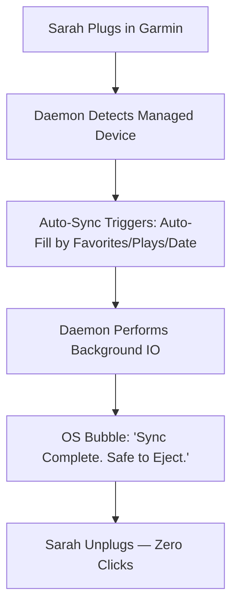

stepsCompleted: ['step-01-init', 'step-02-discovery', 'step-03-core-experience', 'step-04-emotional-response', 'step-05-inspiration', 'step-06-design-system', 'step-07-defining-experience', 'step-08-visual-foundation', 'step-09-design-directions', 'step-10-user-journeys', 'step-11-component-strategy', 'step-12-ux-patterns', 'step-13-responsive-accessibility', 'step-14-complete']
inputDocuments: ['prd.md', 'architecture.md', 'product-brief-bmad-2026-01-26.md', 'project-context.md']
status: 'complete'
completedAt: '2026-01-27'

# UX Design Specification: HifiMule

**Author:** Alexis
**Date:** 2026-01-26

---

## 1. Executive Summary

### 1.1 Project Vision
To create an "Invisible Sync" experience that automates the synchronization between modern media servers and legacy hardware, removing the friction of manual file management while providing a premium, modern selection interface.

### 1.2 Target Personas
*   **The Ritualist (Arthur):** Needs high transparency and "Managed Zone" isolation to protect his manual file structure. Can ignore Auto-Fill entirely and continue manual curation. "Auto" badges provide transparency if mixed mode is used.
*   **The Sprinter (Sarah):** Needs zero friction. Auto-Fill + Auto-Sync on Connect is her primary path — plug in, walk away.
*   **The System Admin (Alexis):** Needs a low-footprint background daemon that remains under 10MB RAM.

---

## 2. Core User Experience

### 2.1 The Defining Experience: "The Delta-Sync Handshake"
The core interaction is the moment a legacy device is connected. The system immediately performs a differential scan and presents a "Live Delta" in the Selection Basket, allowing for a one-click commitment to synchronize.

### 2.2 User Mental Model
Users perceive their legacy hardware as a **physical extension of their Jellyfin library**. They expect server-level metadata (playlists, album art) to be "pushed" to the device without manually managing folder hierarchies.

### 2.3 Success Criteria
*   **Predictive Syncing:** Automatic rule-matching for known devices.
*   **Managed Transparency:** Visual proof that "Personal" files are isolated and safe.
*   **Silent Scrobbling:** Zero-touch processing of Rockbox `.scrobbler.log` files.

### 2.4 Emotional Design Goals
*   **Subtle Reliability:** The tool should feel like a premium, invisible utility.
*   **Calm Assurance:** Eliminating "Sync Anxiety" with clear pre-sync diffs and "Safe to Eject" confirmations.

---

## 3. Design System & Visual Foundation

### 3.1 Design System: Shoelace + Custom Tokens
We utilize **Shoelace (Web Components)** for its extreme performance in Tauri v2 and its framework-agnostic stability.

### 3.2 Visual Theme: "Vibrant Hub"
*   **Primary Palette:** `#52348B` (Jellyfin Purple), `#EBB334` (Amber Gold), `#1A1A2E` (Midnight Surface).
*   **Aesthetic:** Glassmorphism overlays with rich album art grids.
*   **Typography:** **Outfit** (Brand/Headers) and **Inter** (Data/Paths).

---

## 4. Interaction Design & Layout

### 4.1 Chosen Layout: "Basket Centric"
A 70/30 split layout where the **Library Browser** (Left) allows for immersive curation, while the **Selection Basket Sidebar** (Right) provides a detailed, high-confidence overview of the sync delta and storage projections.

### 4.2 User Journey Flow (Sarah's Dash)

---

## 5. Component Strategy

### 5.1 Foundation Components
*   **Library Grid:** Uses Shoelace `<sl-card>` with custom aspect-ratio tokens for album art.
*   **Navigation:** Vertical sidebar using `<sl-tree>` for folder exploration and `<sl-tab-group>` for views.

### 5.2 Custom Components
*   **The Sync Basket:** A real-time "Staging Area" component that calculates literal disk bytes based on transcoding rules.
*   **The Media Delta Overlay:** A visual overlay for album covers showing `(+) Add`, `(-) Remove`, or `(=) Synced` status.

### 5.3 Auto-Fill Components
*   **Auto-Fill Toggle:** Shoelace `<sl-switch>` in the Basket header area, enabling/disabling automatic library fill.
*   **Max Fill Size Control:** `<sl-range>` slider (visible when Auto-Fill is active), allowing the user to cap fill size below full device capacity.
*   **Auto-Fill Slot Card:** A single card in the basket (replaces individual auto-filled track cards) showing the configured capacity target: "Will fill ~X GB with top-priority tracks at sync time". Rendered with a distinct dashed border to signal deferred content. No API call is made when Auto-Fill is toggled on or off — the slot is a local UI marker only.
*   **Artist Entity Card:** Artist basket items render as a single card (identical structure to album cards) showing "Artist · ~N tracks · ~X MB". The track count and size are estimates from artist-level metadata at add-time; the daemon resolves the actual current track list at sync time, including any tracks added to the artist after the basket was built.
*   **Auto Badge / Priority Reason Tags:** Removed — individual auto-filled tracks are no longer displayed in the basket prior to sync.

### 5.4 Device Profile Settings
*   **Auto-sync on connect toggle:** `<sl-switch>` in the device profile panel with helper text: "Automatically start syncing when this device is connected. Works with or without the UI open."
*   **Device Identity** (shown in the Initialize Device dialog — Story 2.9):
    *   `<sl-input>` labelled "Device Name" — required, max 40 chars, prefilled with volume label or "My Device".
    *   Icon picker: a grid of ~6–8 icon options (iPod Classic, Generic DAP, SD Card, USB Drive, Watch, Phone, etc.) rendered as selectable tiles with a highlighted border on selection.
    *   Selected icon and name are confirmed with the existing "Confirm" button and written to the manifest.

### 5.5 Headless Sync Feedback
*   **Without UI:** Tray icon animation (Syncing state) + OS-native notification on completion.
*   **With UI open:** Basket reflects live sync state via `on_sync_progress` events, identical to manual "Start Sync" progress display.

### 5.6 Device Hub

The device hub is a persistent panel displayed whenever at least one managed device is connected. It replaces the conditional `<sl-select>` picker from Story 2.7.

*   **Device cards:** Each connected device is shown as a compact card containing its icon (from the built-in library; fallback: generic USB Drive icon) and its display name (fallback: device_id). The currently selected device card is highlighted with an active border/accent. Clicking any card calls `device.select` and reloads the basket for that device.
*   **No-device-selected state:** When `selectedDevicePath === null`, the hub shows a placeholder: "Select a device to start curating". The basket renders as empty with no storage projection bar. All (+) add buttons in the library browser render as disabled (greyed out, no click interaction). The "Start Sync" button is disabled.
*   **Single device:** The hub is still visible with a single device (not hidden). The single device is auto-selected by the daemon; its card renders as active.

---

## 6. Responsive Design & Accessibility

### 6.1 Responsive Strategy
HifiMule utilizes a **"Detachable Sidebar"** strategy. The UI remains fully functional even when shrunk to a compact utility state, ensuring users can monitor sync progress without sacrificing screen real estate.

### 6.2 Breakpoint Strategy
*   **Narrow (< 600px):** Compact list-view for rapid library scanning.
*   **Standard (600px - 1000px):** Full Basket-Centric split layout.
*   **Wide (> 1000px):** Enhanced data-density view for power users.

### 6.3 Accessibility Strategy
*   **Compliance:** Target WCAG 2.1 Level AA.
*   **Visibility:** High-contrast focus states for keyboard-only navigation.
*   **Semantics:** ARIA-live regions for background sync status updates.

### 6.4 Testing Strategy
*   **Visual Regression:** Testing "Vibrant Hub" aesthetics against diverse OS themes.
*   **A11y Audits:** Automated Lighthouse/Axe verification within the Tauri environment.
