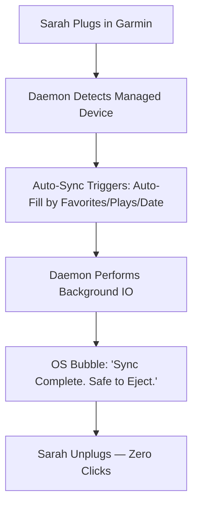

stepsCompleted: ['step-01-init', 'step-02-discovery', 'step-03-core-experience', 'step-04-emotional-response', 'step-05-inspiration', 'step-06-design-system', 'step-07-defining-experience', 'step-08-visual-foundation', 'step-09-design-directions', 'step-10-user-journeys', 'step-11-component-strategy', 'step-12-ux-patterns', 'step-13-responsive-accessibility', 'step-14-complete']
inputDocuments: ['prd.md', 'architecture.md', 'product-brief-bmad-2026-01-26.md', 'project-context.md']
status: 'complete'
completedAt: '2026-01-27'

# UX Design Specification: HifiMule

**Author:** Alexis
**Date:** 2026-01-26

---

## 1. Executive Summary

### 1.1 Project Vision
To create an "Invisible Sync" experience that automates the synchronization between modern media servers and legacy hardware, removing the friction of manual file management while providing a premium, modern selection interface.

### 1.2 Target Personas
*   **The Ritualist (Arthur):** Needs high transparency and "Managed Zone" isolation to protect his manual file structure. Can ignore Auto-Fill entirely and continue manual curation. "Auto" badges provide transparency if mixed mode is used.
*   **The Sprinter (Sarah):** Needs zero friction. Auto-Fill + Auto-Sync on Connect is her primary path — plug in, walk away.
*   **The System Admin (Alexis):** Needs a low-footprint background daemon that remains under 10MB RAM.

---

## 2. Core User Experience

### 2.1 The Defining Experience: "The Delta-Sync Handshake"
The core interaction is the moment a legacy device is connected. The system immediately performs a differential scan and presents a "Live Delta" in the Selection Basket, allowing for a one-click commitment to synchronize.

### 2.2 User Mental Model
Users perceive their legacy hardware as a **physical extension of their media server library** (Jellyfin, Navidrome, or any Subsonic-compatible server). They expect server-level metadata (playlists, album art) to be "pushed" to the device without manually managing folder hierarchies.

### 2.3 Success Criteria
*   **Predictive Syncing:** Automatic rule-matching for known devices.
*   **Managed Transparency:** Visual proof that "Personal" files are isolated and safe.
*   **Silent Scrobbling:** Zero-touch processing of Rockbox `.scrobbler.log` files.

### 2.4 Emotional Design Goals
*   **Subtle Reliability:** The tool should feel like a premium, invisible utility.
*   **Calm Assurance:** Eliminating "Sync Anxiety" with clear pre-sync diffs and "Safe to Eject" confirmations.

---

## 3. Design System & Visual Foundation

### 3.1 Design System: Shoelace + Custom Tokens
We utilize **Shoelace (Web Components)** for its extreme performance in Tauri v2 and its framework-agnostic stability.

### 3.2 Visual Theme: "Vibrant Hub"
*   **Primary Palette:** `#52348B` (Brand Purple), `#EBB334` (Amber Gold), `#1A1A2E` (Midnight Surface).
*   **Aesthetic:** Glassmorphism overlays with rich album art grids.
*   **Typography:** **Outfit** (Brand/Headers) and **Inter** (Data/Paths).

---

## 4. Interaction Design & Layout

### 4.1 Chosen Layout: "Basket Centric"
A 70/30 split layout where the **Library Browser** (Left) allows for immersive curation, while the **Selection Basket Sidebar** (Right) provides a detailed, high-confidence overview of the sync delta and storage projections.

### 4.2 User Journey Flow (Sarah's Dash)

---

## 5. Component Strategy

### 5.1 Foundation Components
*   **Library Grid:** Uses Shoelace `<sl-card>` with custom aspect-ratio tokens for album art.
*   **Navigation:** The Library Browser includes a compact browse-mode control for server-supported views: Artists, Albums, Playlists, Tracks, Genres, Recently Added, Frequently Played, Recently Played, and Favorites. Hierarchical modes use breadcrumbs; smart/history modes use sorted music grids or lists with relevant metadata; the Tracks mode uses a dedicated dual-panel layout (see §5.2). Unsupported provider modes are hidden or unavailable based on daemon capabilities.
*   **List/Table Browse View:** A virtualized (windowed) list/table rendering mode available on all browse pages and drill-down levels — Artists, Albums, Playlists, Genres, Recently Added, Frequently Played, Recently Played, Favorites, and sub-levels such as albums within an artist or tracks within an album. Available as a user-toggled alternative to the paginated `<sl-card>` grid. Renders immediately with the currently loaded items; for Artists and Albums root views, the next page is fetched automatically as the user scrolls (autoload-on-scroll); other modes and sub-levels render what is already loaded. Only visible rows are mounted in the DOM at any time for smooth performance across libraries of thousands of items. The scrollbar reflects the full expected library size from the first render. The view-mode toggle (grid vs list) is a **single global UI state value** that applies uniformly across all browse modes and navigation depths. The A–Z control is a server-side filter in both views (no scroll-to-letter). Breadcrumb navigation, synced badges, and basket add interactions are identical to grid view. Data is shared from the existing `browse.*` RPC layer; switching views does not re-fetch from the daemon.

### 5.2 Custom Components
*   **The Sync Basket:** A real-time "Staging Area" component that calculates literal disk bytes based on transcoding rules.
*   **Server Type Badge (Login Screen):** A small, auto-updating badge next to the server URL field that shows the detected server type as the user types:
    - "Detecting..." (brief debounce while user types)
    - "Jellyfin" (on successful Jellyfin `/System/Info` ping)
    - "Navidrome" (on successful Subsonic ping with `openSubsonic: true`)
    - "Subsonic" (on successful Subsonic ping without OpenSubsonic flag)
    - "Unknown" (if ping fails or URL is invalid)
    
    This live affordance removes the need for a manual server type dropdown while giving users immediate confidence that their URL is understood. Auto-detection is the primary flow; a manual override option is available in advanced settings.
*   **The Media Delta Overlay:** A visual overlay for album covers showing `(+) Add`, `(-) Remove`, or `(=) Synced` status.
*   **"Save selection as playlist" action:** A button/action in the Sync Basket header, visible only when `capabilities().supports_playlist_write` is `true` and the basket is non-empty. Clicking it opens a dialog prompting the user to enter a playlist name (to create a new server playlist) or pick an existing HifiMule-managed playlist to update. When the basket contains an Auto-Fill slot, an inline notice is shown: "Auto-Fill tracks are resolved at sync time and won't be saved to this playlist" — the user can still proceed to save the manual selections. On confirm, calls `playlist.create` with the resolved track IDs.
*   **Playlist Curation View (dual-panel):** A dedicated view for editing server playlists. The left panel lists all artists who have tracks in the selected playlist; selecting an artist shows that artist's albums filtered to playlist-only contents in the right panel. Clicking an album row (not the remove button) focuses it and filters the track panel to that album's tracks. A track panel below both panels shows individual tracks for the selected artist, optionally filtered by the focused album; each track row has a Remove-track affordance. Remove-artist removes all tracks by that artist; Remove-album removes all tracks in that album; Remove-track removes a single track — all via `playlist.removeTracks`. The statistics header includes an "Add tracks" button (shown only when `supports_playlist_write` is `true`); clicking it opens a search dialog that queries the library for tracks by title, artist, or album, and allows the user to select one or more results to append to the playlist via `playlist.addTracks`. After adding, the curation view re-fetches the playlist and re-renders. Artists and albums disappear from their panels when they have no remaining tracks in the playlist. A statistics header displays total track count, total duration, and total storage size (tracks without `sizeBytes` are excluded from the size total without error). The playlist name in the header is editable: clicking it replaces the title with an `<sl-input>` pre-filled with the current name, accompanied by Save (checkmark) and Cancel (×) icon-buttons. On save, `playlist.rename` is called and the header title updates to reflect the new name; on cancel or Escape, the input is dismissed with no change. A delete icon-button (trash) is shown in the header when `supports_playlist_write` is `true`; clicking it opens an `<sl-dialog>` confirming deletion of the named playlist. On confirm, `playlist.delete` is called and the UI navigates back to the playlist browser; on cancel the dialog closes. Edits are written to the server playlist in real time; closing the view leaves the playlist in its final edited state. The artist panel offers an "All artists" entry and the album panel an "All albums" entry, so the complete playlist can be viewed as a single ordered track list. Each track row displays its absolute 1-based playlist position; when the provider supports playlist write, up/down controls let the user move a track relative to its visible neighbours, persisting the new order via `playlist.reorder`. Order numbers remain visible under any artist/album filter so sequencing stays meaningful.
*   **Tracks Browse View (dual-panel, paginated):** A library-wide track-browsing surface laid out like the Playlist Curation View — left panel lists artists, right panel lists albums (filtered by the selected artist), and a bottom panel lists tracks (filtered by the selected artist/album). The key difference from curation: each panel is **auto-paginated** against the entire library via the existing `browse.list*` RPC layer plus the new `browse.listTracks`, with autoload-on-scroll identical to Artists/Albums root views in Story 9.7. The artist panel offers an "All artists" entry; the album panel an "All albums" entry, so the unfiltered global track list is reachable. Each track row exposes (+) add / (-) remove basket affordances (disabled when no device is selected), a right-click "Add to playlist…" context menu, and a per-row "Send to playlist…" visible affordance opening the same flow (both gated on `supports_playlist_write`). The grid/list toggle does not apply to this mode — the dual-panel layout is the sole rendering. A–Z filter controls remain available on the artist and album panels. The mode is hidden when the active provider does not advertise the Tracks capability (e.g., classic Subsonic without `search3`).
*   **Context Menu (right-click):** A right-click context menu that appears on artist cards, album cards, and individual track rows in browse views and in the curation view. On artist/album cards: primary action is "Send to playlist…" — opens a sub-menu or dialog to create a new playlist seeded with that item, or add it to an existing managed playlist. On individual track rows: primary action is "Add to playlist…" — opens a sub-menu or dialog to pick an existing playlist (calls `playlist.addTracks`) or create a new one (calls `playlist.create`). All playlist write actions are available only when `supports_playlist_write` is `true`. Remove actions are shown in the curation view context.

### 5.3 Auto-Fill Components
*   **Auto-Fill Toggle:** Shoelace `<sl-switch>` in the Basket header area, enabling/disabling automatic library fill.
*   **Max Fill Size Control:** `<sl-range>` slider (visible when Auto-Fill is active), allowing the user to cap fill size below full device capacity.
*   **Auto-Fill Slot Card:** A single card in the basket (replaces individual auto-filled track cards) showing the configured capacity target: "Will fill ~X GB with top-priority tracks at sync time". Rendered with a distinct dashed border to signal deferred content. No API call is made when Auto-Fill is toggled on or off — the slot is a local UI marker only.
*   **Artist Entity Card:** Artist basket items render as a single card (identical structure to album cards) showing "Artist · ~N tracks · ~X MB". The track count and size are estimates from artist-level metadata at add-time; the daemon resolves the actual current track list at sync time, including any tracks added to the artist after the basket was built.
*   **Auto Badge / Priority Reason Tags:** Removed — individual auto-filled tracks are no longer displayed in the basket prior to sync.

### 5.4 Device Profile Settings
*   **Auto-sync on connect toggle:** `<sl-switch>` in the device profile panel with helper text: "Automatically start syncing when this device is connected. Works with or without the UI open."
*   **Device Identity, Profile, and Folders** (shown in the Initialize Device dialog and Device Settings):
    *   `<sl-input>` labelled "Device Name" — required, max 40 chars, prefilled with volume label or "My Device".
    *   Icon picker: a grid of ~6–8 icon options (iPod Classic, Generic DAP, SD Card, USB Drive, Watch, Phone, etc.) rendered as selectable tiles with a highlighted border on selection.
    *   Transcoding profile selector: populated from `device_profiles.list`, with passthrough/direct sync as the default. This appears before folder inputs because profiles can prefill folder defaults.
    *   Music folder input: device-relative folder path used for managed track files. When the selected profile provides `defaultMusicFolder`, it is prefilled unless the user has already edited folders.
    *   Playlist folder input: optional device-relative folder path used for `.m3u` files. When the selected profile provides `defaultPlaylistFolder`, it is prefilled unless the user has already edited folders; otherwise, empty inherits the music folder.
    *   Selected icon, name, transcoding profile, music folder, and playlist folder are confirmed with the existing action button and written to the manifest.

### 5.5 Headless Sync Feedback
*   **Without UI:** Tray icon animation (Syncing state) + OS-native notification on completion.
*   **With UI open:** Basket reflects live sync state via `on_sync_progress` events, identical to manual "Start Sync" progress display.

### 5.6 Device Hub

The device hub is a persistent panel displayed whenever at least one managed device is connected. It replaces the conditional `<sl-select>` picker from Story 2.7.

*   **Device cards:** Each connected device is shown as a compact card containing its icon (from the built-in library; fallback: generic USB Drive icon) and its display name (fallback: device_id). The currently selected device card is highlighted with an active border/accent. Clicking any card calls `device.select` and reloads the basket for that device.
*   **Device settings:** The selected device exposes an edit action that opens Device Settings. Name, icon, and transcoding profile changes apply without requiring device reconnect. Music folder or playlist folder changes show cleanup/resync impact in the next sync preview before writes occur.
*   **No-device-selected state:** When `selectedDevicePath === null`, the hub shows a placeholder: "Select a device to start curating". The basket renders as empty with no storage projection bar. All (+) add buttons in the library browser render as disabled (greyed out, no click interaction). The "Start Sync" button is disabled.
*   **Single device:** The hub is still visible with a single device (not hidden). The single device is auto-selected by the daemon; its card renders as active.

---

## 6. Responsive Design & Accessibility

### 6.1 Responsive Strategy
HifiMule utilizes a **"Detachable Sidebar"** strategy. The UI remains fully functional even when shrunk to a compact utility state, ensuring users can monitor sync progress without sacrificing screen real estate.

### 6.2 Breakpoint Strategy
*   **Narrow (< 600px):** Compact list-view for rapid library scanning.
*   **Standard (600px - 1000px):** Full Basket-Centric split layout.
*   **Wide (> 1000px):** Enhanced data-density view for power users.

### 6.3 Accessibility Strategy
*   **Compliance:** Target WCAG 2.1 Level AA.
*   **Visibility:** High-contrast focus states for keyboard-only navigation.
*   **Semantics:** ARIA-live regions for background sync status updates.

### 6.4 Testing Strategy
*   **Visual Regression:** Testing "Vibrant Hub" aesthetics against diverse OS themes.
*   **A11y Audits:** Automated Lighthouse/Axe verification within the Tauri environment.
